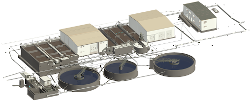
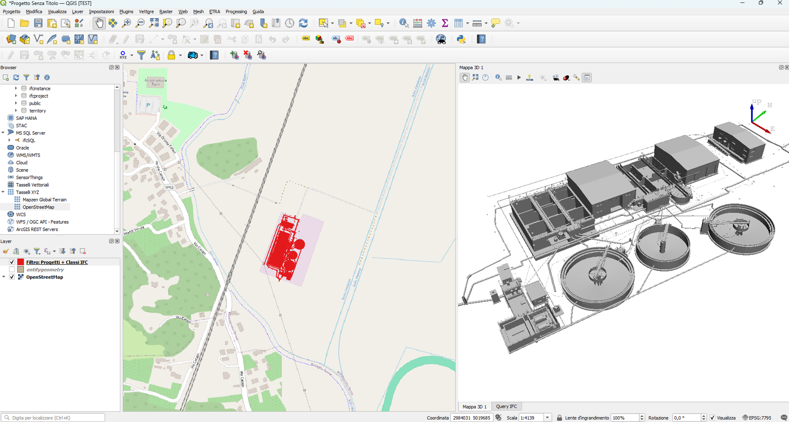
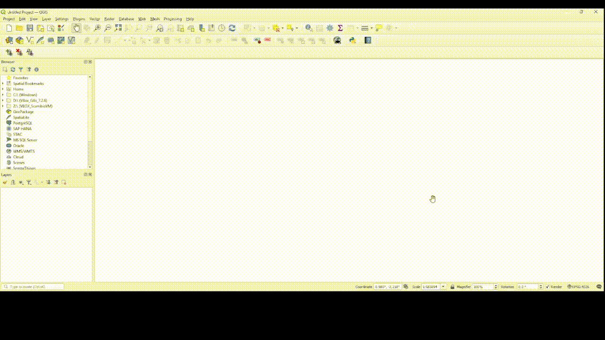
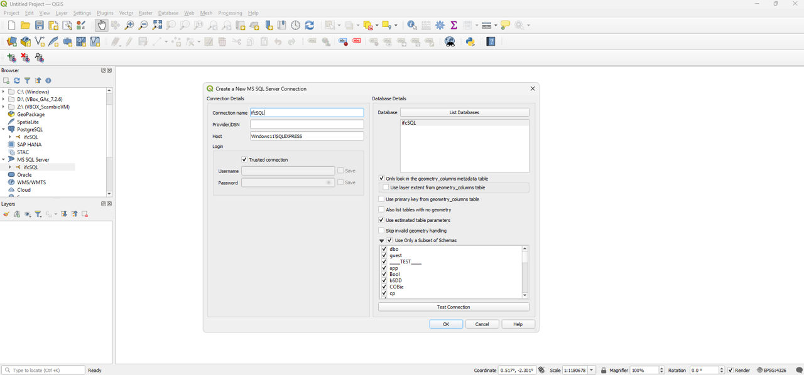
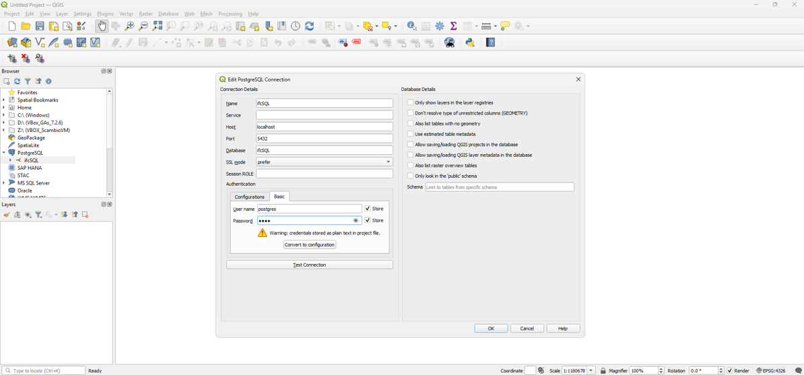
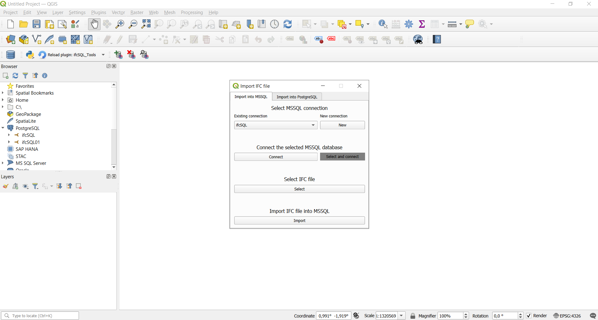
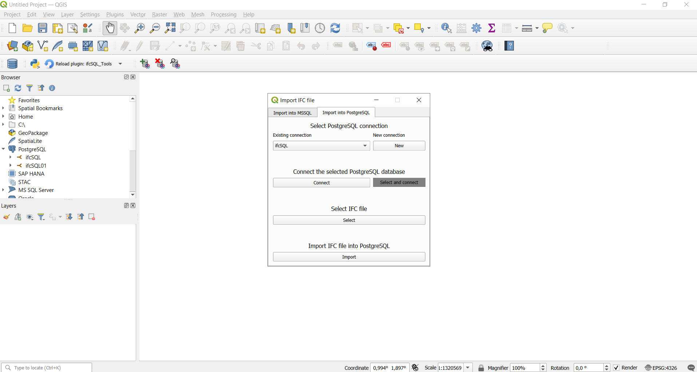
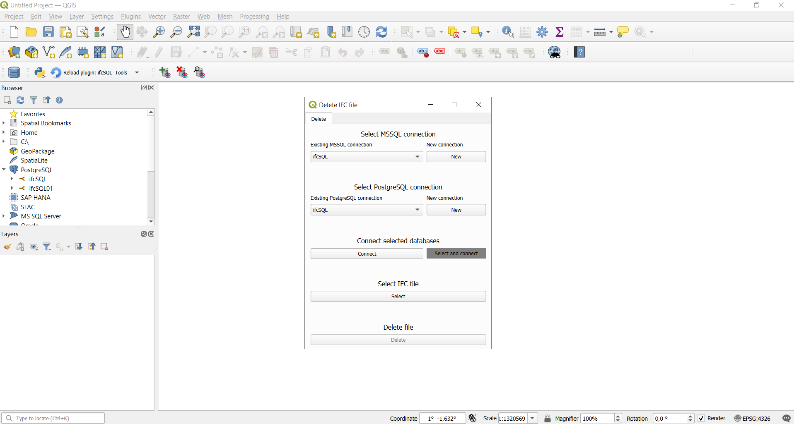
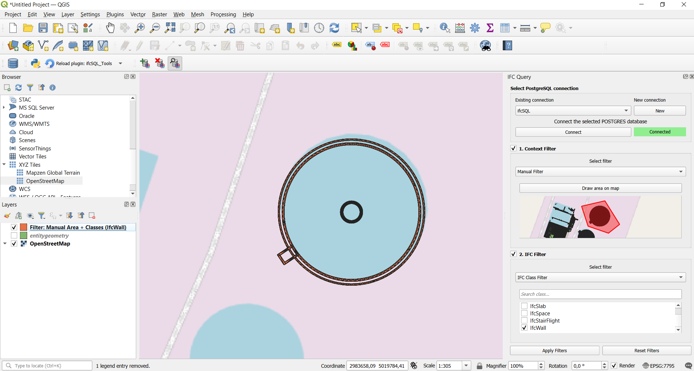

#  ifcSQL_Tools_for_QGIS 
This repository contains the code for the ifcSQL_Tools QGIS plugin that allows you to interact with (load, view, filter, and delete) IFC data stored in the ifcSQL database. 

What can you do with this plugin?
- Load all your georeferenced IFC models into database;
- View all your IFC models simultaneously on a map (in 2D or 3D);
- Filter and display only the IFC classes that interest you;
- Delete the IFC models you no longer need from the database;

Below is an example of a wastewater treatment plant consisting of 21 IFC files.   

  

    

> [!NOTE]
> 
> Currently, the plugin is designed to work only on Windows and with QGIS 3.
>
  

# 🛠️ How to install and set up the plugin? 

(1) Download the **`Source code (zip)`** from the "Releases".
      

(2) Install the plugin from the ZIP file in QGIS. 
      

(3) Open the plugin folder, then open the “first_installation” folder and follow the instructions starting with the first PDF file: [0.Start with ifcSQL_Tools.pdf](./first_installation/)
      

> [!NOTE]
> Here you can find the video tutorial on how to install and set up the plugin: https://www.youtube.com/watch?v=iwmdUl1p-14
>
  

# 🚀 How to use the plugin?

(0) Before you start using the plugin, you need to connect to the two databases (MSSQL and PostgreSQL) that you created in the previous steps.
      
      

(1) You can import an IFC file using the “Import IFC file” button. Remember that you must import the file first into MSSQL and then into PostgreSQL for the process to be complete. If you need help georeferencing an IFC model, see: https://ifcgref.bk.tudelft.nl/. The steps to follow (for both databases) are:
- Select an existing connection or create a new one.
- Connect to the selected database.
- Select the IFC file you want to import (to import into PostgreSQL the plugin will suggest the last file imported into MSSQL).
- Import the IFC file.

It is recommended to split larger models into multiple IFC files to speed up the loading process, which might otherwise be slow.

> [!NOTE]
> Currently, you must import georeferenced IFC models that use the same coordinate reference system (CRS). If you import IFC models with different CRSs, they will all appear on a single
layer in QGIS, causing some models to be displayed at an incorrect geographic location relative to the QGIS map’s CRS.
> 

      
      

(2) You can delete an IFC file using the “Delete IFC file” button. The file will be deleted from both databases or only from MSSQL if it has not alredy been imported into PostgreSQL. The steps to follow are:
- Select the existing connections (both databases).
- Connect to the selected databases.
- Select the IFC file you want to delete (the plugin will show you whether the file is present only in MSSQL or in both databases).
- Delete the IFC file.
      

(3)You can query IFC geometries using the “IFC Query” button. You can filter the IFC geometries in your database by following these steps:
- Select an existing connection.
- Connect to the database.
- Decide whether to use both the context filter and the IFC filter (you can disable one of them).
- In the context filter, you can use three types of filters: “default filter” if you have geographical areas loaded in your database; “manual filter” if you want to draw the area extents; “project filter” if you want to filter by a specific IFC file.
- In the IFC filter, you can select which IFC class or classes to filter by.
- Apply filter.
      

# 🔍 How to view imported geometries?

Once the data has been imported (MSSQL + PostgreSQL), you can easily view your IFC geometries directly within QGIS. Just follow the steps below:
- Import the `entitygeometry` table from PostgreSQL using a simple drag-and-drop.
- Import `OpenStreetMap` layer to provide a geographical background. 
- Access the layer properties and enable the 3D view representation.
- Click the "3D map view" button.

      

