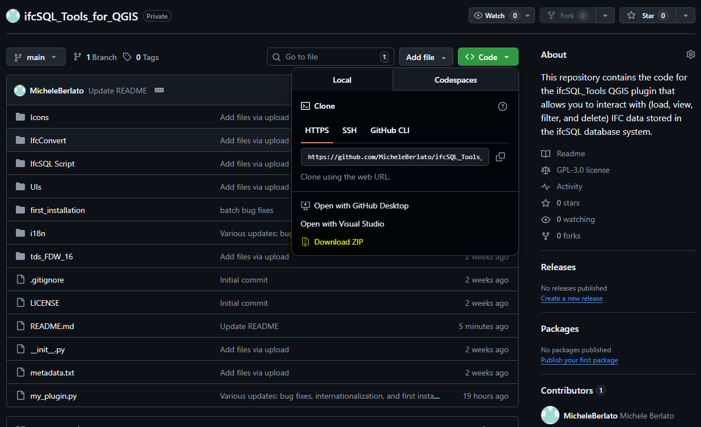
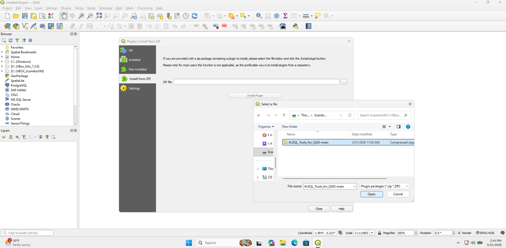

#  ifcSQL_Tools_for_QGIS 
This repository contains the code for the ifcSQL_Tools QGIS plugin that allows you to interact with (load, view, filter, and delete) IFC data stored in the ifcSQL database system.

# How to install the plugin?

(1) Download the ZIP file.
      

(2) Install the plugin from the ZIP in QGIS. 
      

(3) Open the plugin folder, then open the “first_installation” folder and follow the instructions starting with the first PDF file: 0.Start with ifcSQL_Tools.
      

# How to use the plugin?

